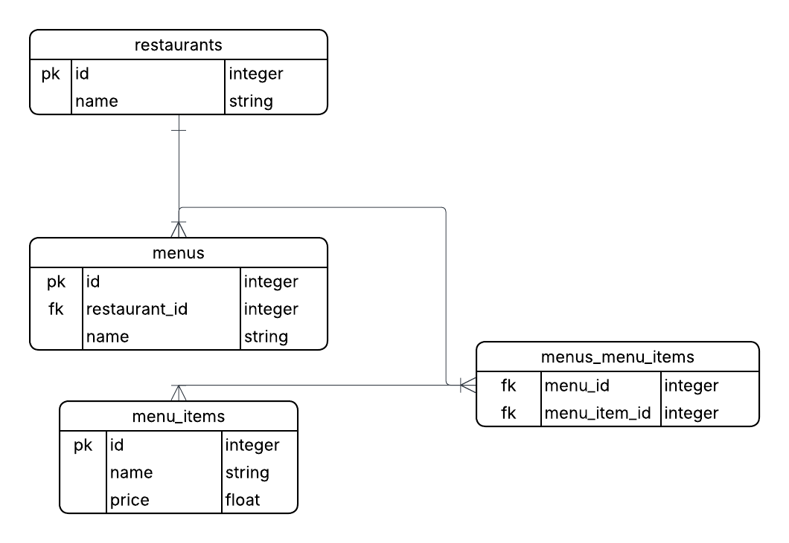

# Restaurant Menu

This service is a simple Rails 7 API for managing restaurants, menus, and menu items. It includes a JSON import tool (via HTTP and Rake) that reads a payload containing restaurants → menus → menu_items and persists them to the database.

Contents

* Overview
* How to Run
* Main Endpoints
* JSON Import
* Rake Task (CLI)
* Tests
* Use Cases and Examples
* Notes and Next Steps

## Overview

Main models:

* `Restaurant` (has_many :menus)
* `Menu` (belongs_to :restaurant, habtm :menu_items)
* `MenuItem` (has_and_belongs_to_many :menus) — `name` is unique in the database

A service called `JsonImporterService` processes a JSON payload with the given structure and returns operation logs.

## Database model (visual)

Want a quick mental map of how the data is organized? Click the diagram to open the full-size image.

<p align="center">
  <a href="docs/database-model.png" target="_blank">
    
  </a>
</p>

Figure: Restaurants own Menus; Menus have a many-to-many link to MenuItems. MenuItem names are unique across the system and prices are stored on the MenuItem model.

Tip: Use this diagram when you add features — it helps reason about where validations, indexes and foreign keys belong.

## How to Run (Development)

Prerequisites: Ruby 3.4.6, Bundler, and a configured PostgreSQL database (`config/database.yml`). In the `restaurant-menu-api` directory:

```bash
cd restaurant-menu-api
bundle install
bin/rails db:create db:migrate db:seed # if needed
bin/rails s -p 3000
```

The API will be available at `http://localhost:3000` by default.

## Main Endpoints

* GET /api/v1/restaurants → lists restaurants (includes menus and items via serializer)
* GET /api/v1/restaurants/:id → details of a specific restaurant
* GET /api/v1/menus → lists all menus
* GET /api/v1/menus/:id → details of a specific menu
* GET /api/v1/menus/:menu_id/menu_items → lists menu items for a menu
* POST /api/v1/imports → endpoint for importing JSON (see section below)

The serializers return plain JSON with the basic fields of each model.

## JSON Import (HTTP)

The `POST /api/v1/imports` endpoint accepts:

* Raw JSON in the request body (`Content-Type: application/json`)
* File upload via multipart/form-data in the `file` field

Examples using `curl`:

* Sending the file as raw JSON body:

```bash
curl -X POST http://localhost:3000/api/v1/imports \
  -H "Content-Type: application/json" \
  -d @spec/fixtures/files/restaurant_data.json
```

* Multipart upload (with `file` field):

```bash
curl -X POST http://localhost:3000/api/v1/imports \
  -F "file=@spec/fixtures/files/restaurant_data.json"
```

* Testing invalid JSON (the controller will catch and return 400):

```bash
curl -X POST http://localhost:3000/api/v1/imports \
  -H "Content-Type: text/plain" \
  -d 'not-json'
```

Example response (success 200):

```json
{
  "success": true,
  "logs": [
    { "menu": "lunch", "item": "Burger", "status": "created_or_linked" },
    { "menu": "lunch", "item": "Small Salad", "status": "created_or_linked" }
  ]
}
```

If a JSON parsing error occurs: `400 Bad Request` with `{ success: false, error: 'invalid_json', message: ... }`.

If a service-level failure occurs (e.g., validation error), the response will be `422` with `success: false` and a `logs` array describing the issues (depending on the service implementation).

Demonstration screenshots of the above tests:


## Rake Task (CLI)

There is a Rake task to import a local file:

```bash
cd restaurant-menu-api
rake import:from_file FILE=/absolute/path/to/restaurant_data.json
```

Validation and exit codes:

* 0: success
* 2: missing `FILE` parameter or file not found
* 3: invalid JSON (parse error)
* 4: import service not found (look for `JsonImporterService` or `JsonImporter` under `app/services`)
* 5: exception during import (stack trace printed to STDERR)
* 6: import executed but returned unexpected format (legacy service)

Example output (success):

```
Success: true
Logs:
[{menu: "lunch", item: "Burger", status: "created_or_linked"}, ...]
```

## Tests

To run the test suite (RSpec):

```bash
cd restaurant-menu-api
bundle exec rspec
```

The specs include model tests, request specs for endpoints, and service specs for the importer (covering import and reimport to verify deduplication).

## Use Cases and Recommendations

* To import a batch of menus and items (from the provided JSON file), use the HTTP endpoint or the Rake task.
* Reimporting the same file: `MenuItem` is identified by `name` and will not be duplicated; its price will be updated based on the payload.
* Accepted structures for menu items: either `menu_items` or `dishes` (the importer detects both).
