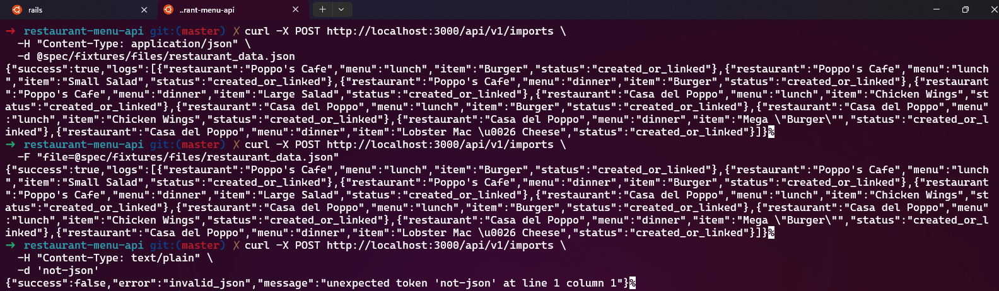
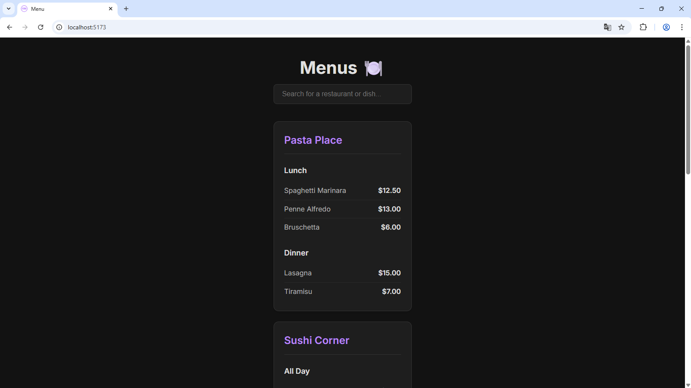
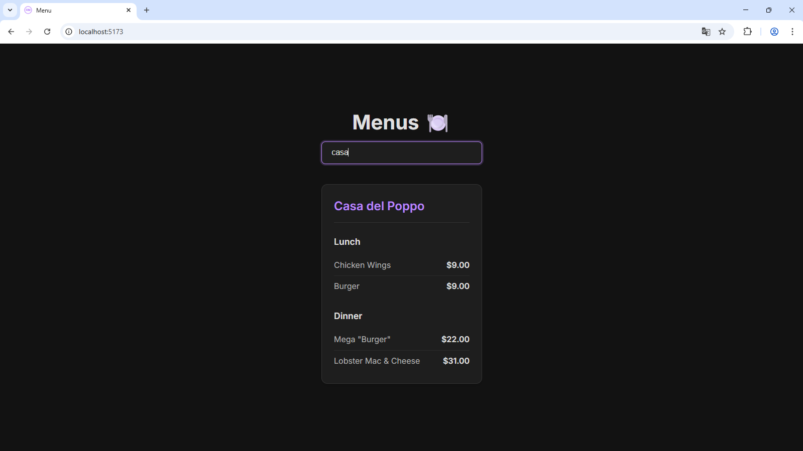
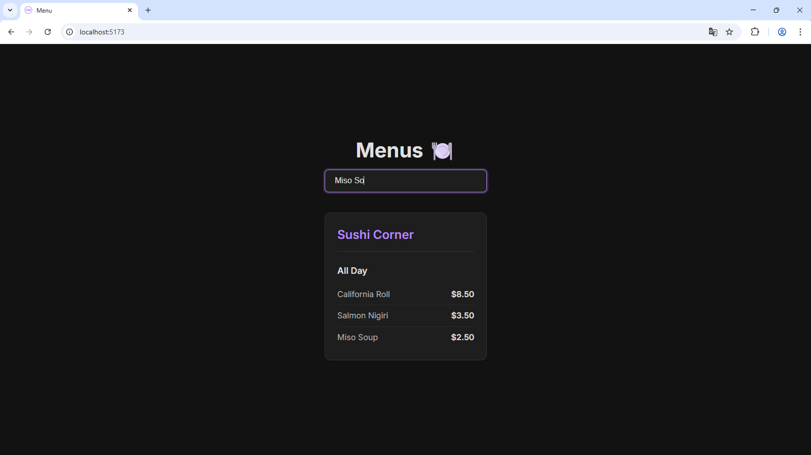

# Restaurant Menu

This service is a simple Rails 7 API for managing restaurants, menus, and menu items. It includes a JSON import tool (via HTTP and Rake) that reads a payload containing restaurants → menus → menu_items and persists them to the database.

## Overview

Main models:

* `Restaurant` (has_many :menus)
* `Menu` (belongs_to :restaurant, habtm :menu_items)
* `MenuItem` (has_and_belongs_to_many :menus) — `name` is unique in the database

A service called `JsonImporterService` processes a JSON payload with the given structure and returns operation logs.

## Database model (visual)

Want a quick mental map of how the data is organized? Click the diagram to open the full-size image.

<p align="center">
  <a href="docs/database-model.png" target="_blank">
    
  </a>
</p>

Figure: Restaurants own Menus; Menus have a many-to-many link to MenuItems. MenuItem names are unique across the system and prices are stored on the MenuItem model.

Tip: Use this diagram when you add features — it helps reason about where validations, indexes and foreign keys belong.

## How to Run (Development)

Prerequisites: Ruby 3.4.6, Bundler, and a configured PostgreSQL database (`config/database.yml`). In the `restaurant-menu-api` directory:

```bash
cd restaurant-menu-api
bundle install
bin/rails db:create db:migrate db:seed # if needed
bin/rails s -p 3000
```

The API will be available at `http://localhost:3000` by default.

## Main Endpoints

* GET /api/v1/restaurants → lists restaurants (includes menus and items via serializer)
* GET /api/v1/restaurants/:id → details of a specific restaurant
* GET /api/v1/menus → lists all menus
* GET /api/v1/menus/:id → details of a specific menu
* GET /api/v1/menus/:menu_id/menu_items → lists menu items for a menu
* POST /api/v1/imports → endpoint for importing JSON (see section below)

The serializers return plain JSON with the basic fields of each model.

## JSON Import (HTTP)

The `POST /api/v1/imports` endpoint accepts:

* Raw JSON in the request body (`Content-Type: application/json`)
* File upload via multipart/form-data in the `file` field

### Examples using `curl`

* Sending the file as raw JSON body:

```bash
curl -X POST http://localhost:3000/api/v1/imports \
  -H "Content-Type: application/json" \
  -d @spec/fixtures/files/restaurant_data.json
```

* Multipart upload (with `file` field):

```bash
curl -X POST http://localhost:3000/api/v1/imports \
  -F "file=@spec/fixtures/files/restaurant_data.json"
```

* Testing invalid JSON (the controller will catch and return 400):

```bash
curl -X POST http://localhost:3000/api/v1/imports \
  -H "Content-Type: text/plain" \
  -d 'not-json'
```

### Example importing via Postman (payload)

You can test the import using Postman raw JSON payload.

1) Raw JSON (Body -> raw -> JSON)

- Method: POST
- URL: http://localhost:3000/api/v1/imports
- Headers: Content-Type: application/json
- Body (raw JSON): paste the payload below.

Example raw body (shortened):

```json
{
  "restaurants": [
    {
      "name": "Poppo's Cafe",
      "menus": [
        {
          "name": "lunch",
          "menu_items": [
            { "name": "Burger", "price": 9.00 },
            { "name": "Small Salad", "price": 5.00 }
          ]
        }
      ]
    }
  ]
}
```
Press Send. You should receive a JSON response with `success` and `logs`.

Example response (success 200):

```json
{
  "success": true,
  "logs": [
    { "menu": "lunch", "item": "Burger", "status": "created_or_linked" },
    { "menu": "lunch", "item": "Small Salad", "status": "created_or_linked" }
  ]
}
```

If a JSON parsing error occurs: `400 Bad Request` with `{ success: false, error: 'invalid_json', message: ... }`.

If a service-level failure occurs (e.g., validation error), the response will be `422` with `success: false` and a `logs` array describing the issues (depending on the service implementation).

### Demonstration screenshots of the above tests:
<p align="center">
  <a href="docs/import-test-bash.png" target="_blank">
    
  </a>
  <br/>
  <small>Figure: Terminal run of Rake import + quick smoke tests (click to view full size).</small>
</p>

## Rake Task (CLI)

There is a Rake task to import a local file:

```bash
cd restaurant-menu-api
rake import:from_file FILE=/absolute/path/to/restaurant_data.json
```

Example output (success):

```
Success: true
Logs:
[{menu: "lunch", item: "Burger", status: "created_or_linked"}, ...]
```

## Tests

To run the test suite (RSpec):

```bash
cd restaurant-menu-api
bundle exec rspec
```

The specs include model tests, request specs for endpoints, and service specs for the importer (covering import and reimport to verify deduplication).

## Restaurant Menu Client (frontend)

There is a small React + Vite frontend in the `restaurant-menu-client` folder that demonstrates the API. It fetches `GET /api/v1/restaurants` and shows restaurants, their menus and menu items.

### Requirements

- Node.js (recommended 18+)
- npm or yarn

### Configure the client

The client reads the backend URL from the `VITE_API_URL` environment variable at build/dev time. Example values:

- Local development (Rails running on localhost): `http://localhost:3000`

Set the variable when running the dev server or when building:

```bash
# from the project root
cd restaurant-menu-client

# Dependencies installation
npm install

# Start dev server, telling Vite where the API is:
VITE_API_URL=http://localhost:3000 npm run dev

# Preview the built bundle (after build):
npm run preview
```

Tip: if you use a cross-platform runner, you can also add a `.env` file in `restaurant-menu-client` with the line:

```
VITE_API_URL=http://localhost:3000
```

Ensure the API is running (see above). By default the Rails API runs on port 3000.

Open the URL printed by Vite (usually `http://localhost:5173`) and you should see the app listing restaurants and menus.

### Demo screenshot

<p align="center">
  <a href="docs/demo1.png" target="_blank">
    
  </a>
</p>

<p align="center">
  <a href="docs/demo2.png" target="_blank">
    
  </a>
</p>

<p align="center">
  <a href="docs/demo3.png" target="_blank">
    
  </a>
</p>

## Use Cases and Recommendations

* To import a batch of menus and items (from the provided JSON file), use the HTTP endpoint or the Rake task.
* Reimporting the same file: `MenuItem` is identified by `name` and will not be duplicated; its price will be updated based on the payload.
* Accepted structures for menu items: either `menu_items` or `dishes` (the importer detects both).